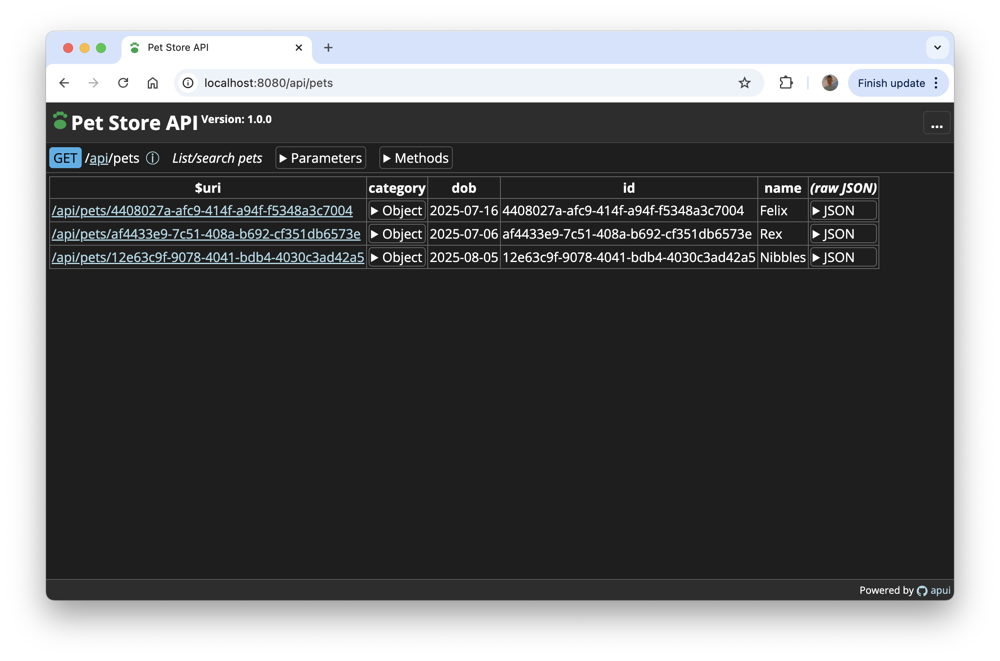

# apui
[](https://pkg.go.dev/github.com/go-andiamo/apui)
[](https://github.com/go-andiamo/apui/releases)
[](https://goreportcard.com/report/github.com/go-andiamo/apui)

Make your API browsable!

A golang drop-in package to make your APIs render as browsable, interactive HTML. 



---

## Features

- Single call to write API results as HTML
- Theme support
- Fully configurable
- Uses [Aitch](https://github.com/go-andiamo/aitch) for low GC pressure rendering
- Optionally uses [Chioas](https://github.com/go-andiamo/chioas) for documentation

---

## Working demo

See [Example](https://github.com/go-andiamo/apui/tree/main/_examples/petstore)

---

## Installation

```bash
go get github.com/go-andiamo/apui
```


